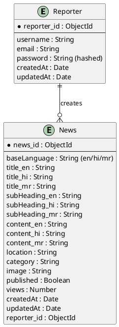
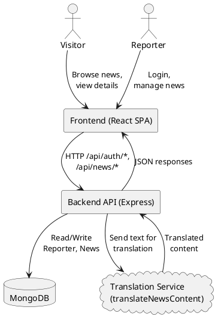
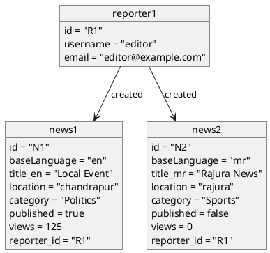
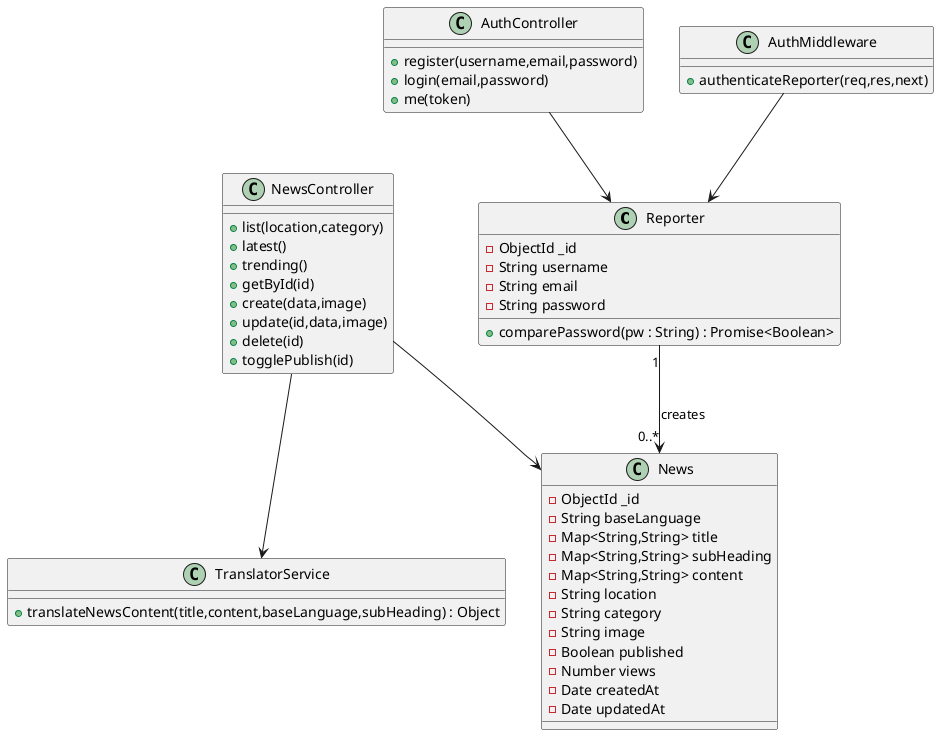
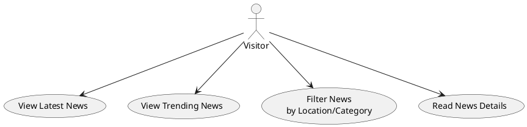
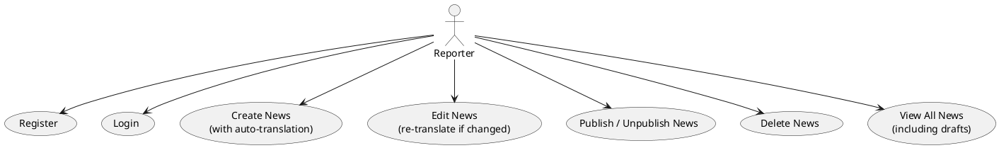
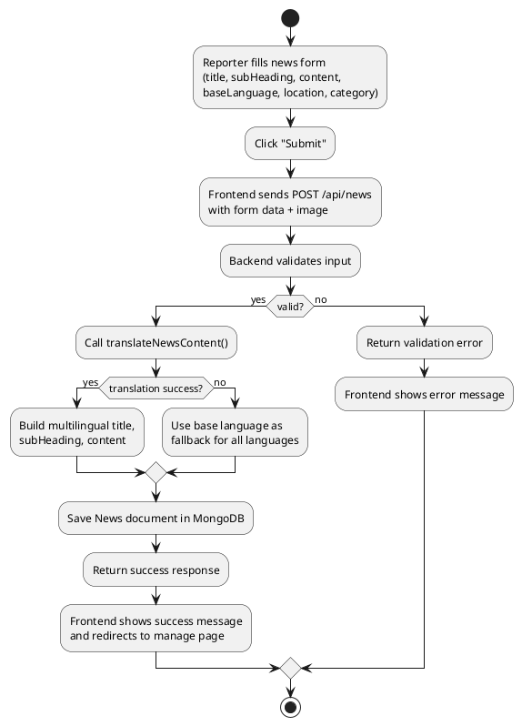
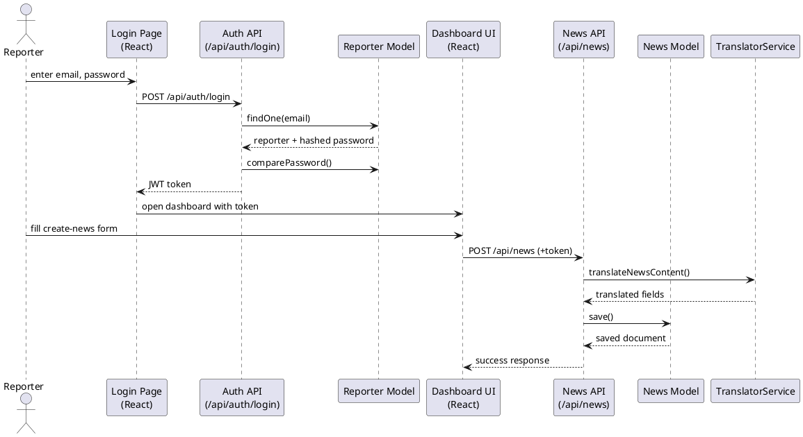
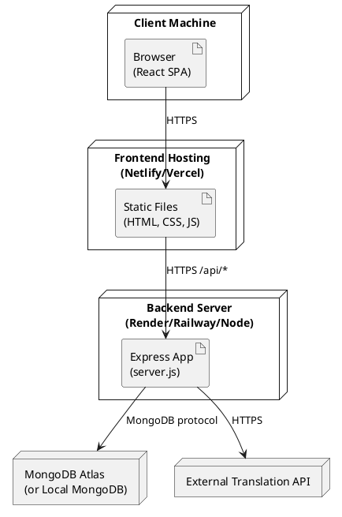
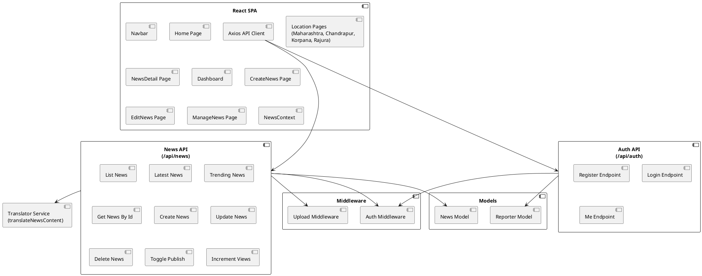

Multilingual News Portal – Diagrams & Data Design
===============================================

This document contains all required diagrams and data design sections for the project.
You can open this file in any editor, or open it directly in Microsoft Word and then
save it as a `.docx` file for submission.

----------------------------------------
3.1 Entity Relationship Diagram (ERD)
----------------------------------------

Conceptual ERD between `Reporter` and `News`:

----------------------------------------
3.2 Data Flow Diagram (DFD – Level 0)
----------------------------------------

------------------------------
3.3 Object Diagram (Snapshot)
------------------------------

-------------------------
3.4 Class Diagram (Backend)
-------------------------

------------------
3.5 Use Case Diagrams
------------------

### 3.5.1 Visitor Use Cases

### 3.5.2 Reporter Use Cases

-------------------------------------------
3.6 Activity Diagram – Create News Process
-------------------------------------------

-----------------------------------------
3.7 Collaboration (Communication) Diagram
-----------------------------------------

----------------------
3.8 Deployment Diagram
----------------------

----------------------
3.9 Component Diagram
----------------------

-----------------
3.10 Table Design
-----------------

Relational-style view of the MongoDB collections.

**Table: Reporter**

| Column       | Type     | Constraints             | Description                   |
|-------------|----------|-------------------------|-------------------------------|
| reporter_id | ObjectId | PK                      | Unique reporter ID            |
| username    | VARCHAR  | NOT NULL, UNIQUE        | Login name                    |
| email       | VARCHAR  | NOT NULL, UNIQUE        | Reporter email                |
| password    | VARCHAR  | NOT NULL                | Hashed password               |
| createdAt   | DATETIME | NOT NULL (default NOW)  | Created timestamp             |
| updatedAt   | DATETIME | NOT NULL (auto)         | Last update timestamp         |

**Table: News**

| Column        | Type     | Constraints                                                  | Description                          |
|--------------|----------|--------------------------------------------------------------|--------------------------------------|
| news_id      | ObjectId | PK                                                           | Unique news ID                       |
| baseLanguage | VARCHAR  | NOT NULL, CHECK in ('en','hi','mr')                          | Original language                    |
| title_en     | TEXT     | NOT NULL                                                     | English title                        |
| title_hi     | TEXT     |                                                              | Hindi title                          |
| title_mr     | TEXT     |                                                              | Marathi title                        |
| subHeading_en| TEXT     |                                                              | English subheading                   |
| subHeading_hi| TEXT     |                                                              | Hindi subheading                     |
| subHeading_mr| TEXT     |                                                              | Marathi subheading                   |
| content_en   | TEXT     | NOT NULL                                                     | English content                      |
| content_hi   | TEXT     |                                                              | Hindi content                        |
| content_mr   | TEXT     |                                                              | Marathi content                      |
| location     | VARCHAR  | NOT NULL, CHECK in ('maharashtra','chandrapur','korpana','rajura') | Coverage location             |
| category     | VARCHAR  | NOT NULL                                                     | Category (Politics, Sports, etc.)    |
| image        | VARCHAR  | NULL                                                         | Image path                           |
| published    | BOOLEAN  | NOT NULL DEFAULT false                                       | Publish status                       |
| views        | INT      | NOT NULL DEFAULT 0                                           | View counter                         |
| reporter_id  | ObjectId | FK -> Reporter(reporter_id)                                  | Author                               |
| createdAt    | DATETIME | NOT NULL                                                     | Created timestamp                    |
| updatedAt    | DATETIME | NOT NULL                                                     | Updated timestamp                    |

-------------------
3.11 Data Dictionary
-------------------

**Entity: Reporter**

| Field     | Type     | Description                                      |
|-----------|----------|--------------------------------------------------|
| _id       | ObjectId | Unique reporter identifier                       |
| username  | String   | Reporter login name                              |
| email     | String   | Reporter email (unique, lowercased)             |
| password  | String   | Hashed password (bcrypt)                         |
| createdAt | Date     | Auto-set creation time                           |
| updatedAt | Date     | Auto-set last update time                        |

**Entity: News**

| Field         | Type              | Description                                                    |
|---------------|-------------------|----------------------------------------------------------------|
| _id           | ObjectId          | Unique news identifier                                         |
| baseLanguage  | String (en/hi/mr) | Language in which reporter originally wrote the article        |
| title.en      | String            | Title in English                                               |
| title.hi      | String            | Title in Hindi                                                 |
| title.mr      | String            | Title in Marathi                                               |
| subHeading.en | String            | Subheading in English                                          |
| subHeading.hi | String            | Subheading in Hindi                                            |
| subHeading.mr | String            | Subheading in Marathi                                          |
| content.en    | String            | Full content in English                                        |
| content.hi    | String            | Full content in Hindi                                          |
| content.mr    | String            | Full content in Marathi                                        |
| location      | String            | One of: maharashtra, chandrapur, korpana, rajura              |
| category      | String            | News category (Politics, Sports, Crime, etc.)                  |
| image         | String            | Relative path to uploaded image (`/uploads/...`)               |
| published     | Boolean           | Whether article is visible to public users                     |
| views         | Number            | Non-negative integer count of detail-page views                |
| createdAt     | Date              | Auto-set creation time                                         |
| updatedAt     | Date              | Auto-set last update time                                      |

