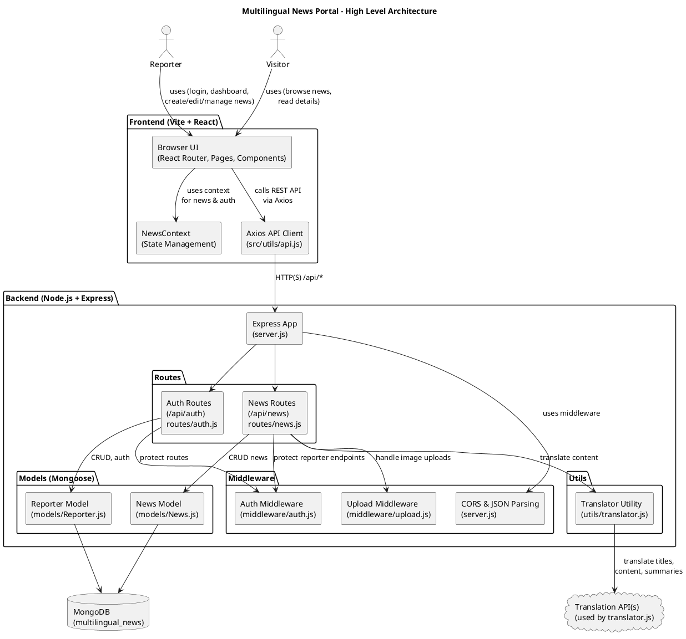

Multilingual News Portal - Architecture Diagram
==============================================

This document contains the PlantUML code for the high-level architecture diagram of your project. 
You can copy this code into any PlantUML-compatible tool to render the diagram, or keep this file 
as a reference and open it in Microsoft Word (Word can open .md or .txt files) and then save it as a .docx file.

----------------------------------------
PlantUML Diagram Source Code
----------------------------------------

